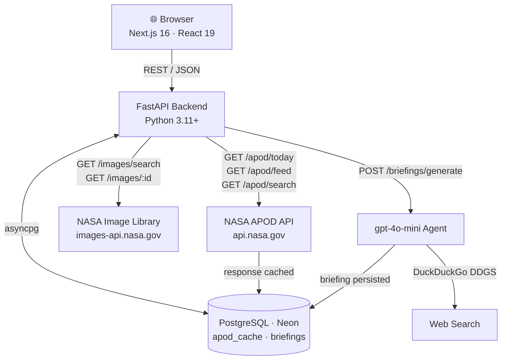
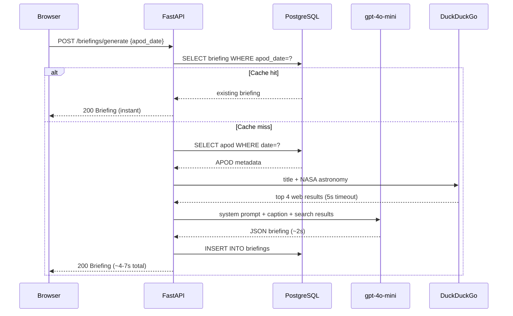
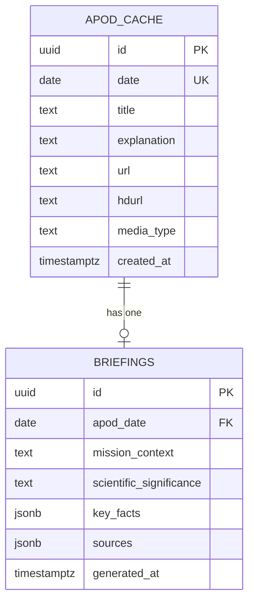
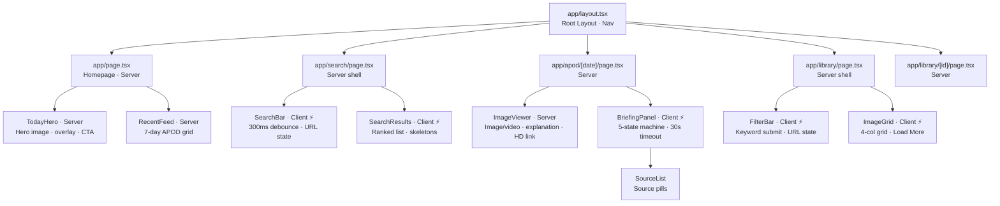

# AstroLens

An AI astronomy intelligence platform. AstroLens surfaces NASA imagery alongside AI-synthesized briefings that give each image context: mission history, scientific significance, and discovery background — generated in real time from NASA APIs and web search.

**Live demo:** [https://frontend-rose-six-21.vercel.app](https://frontend-rose-six-21.vercel.app)

---

## Features

| Feature | Description |
|---|---|
| **Today's APOD** | Homepage hero showing NASA's Astronomy Picture of the Day with a "Read Full Briefing" CTA |
| **Recent Feed** | Last 7 APODs in a responsive grid; click any to open its detail page |
| **AI Briefing** | On-demand briefing per APOD: mission context, scientific significance, 5 key facts, and web sources — generated by a gpt-4o-mini agent, cached permanently |
| **APOD Full-Text Search** | Search the APOD archive by keyword; results ranked by PostgreSQL relevance score |
| **NASA Image Library** | Browse and keyword-search 10,000+ NASA assets via the Image Library API |
| **Library Detail** | Full image, description, and keyword tags for any NASA library asset |
| **Responsive UI** | Dark space theme, mobile-first (320px → 1440px+), skeleton loading states |

---

## Architecture

### High-Level Design



### Request Flow — Briefing Generation



---

## Low-Level Design

### Database Schema



A GIN index on `to_tsvector('english', title || ' ' || explanation)` powers full-text search with `ts_rank` ordering.

> `nasa_images` table is defined in the schema for future caching; NASA Image Library results are currently served live from NASA's API without local persistence.

### API Endpoints

Base URL: `/api/v1`

| Method | Path | Description | Rate Limit |
|---|---|---|---|
| `GET` | `/` | Health check | — |
| `GET` | `/apod/today` | Today's APOD (DB-cached) | 60/min |
| `GET` | `/apod/feed?start=&end=` | APOD date range, max 30 days | 60/min |
| `GET` | `/apod/search?q=&limit=` | Full-text search, ranked results | 60/min |
| `GET` | `/images/search?q=&page=&limit=` | NASA Image Library search | 60/min |
| `GET` | `/images/{nasa_id}` | Single NASA library asset | 60/min |
| `GET` | `/briefings/{date}` | Cached briefing or 404 | — |
| `POST` | `/briefings/generate` | Generate + persist briefing | 10/min |

### Frontend Component Tree



Server Components fetch at render time. Client Components (`⚡`) manage interactive state: briefing generation, search debounce, library filtering.

---

## Tech Stack

### Backend

| Library | Version | Role |
|---|---|---|
| Python | 3.11+ | Runtime |
| FastAPI | 0.111.0 | Web framework |
| uvicorn | 0.29.0 | ASGI server |
| asyncpg | 0.30.0 | PostgreSQL async driver (no ORM, raw SQL) |
| httpx | 0.27.0 | Async HTTP client for NASA APIs |
| openai | 1.30.0 | gpt-4o-mini inference |
| ddgs | 9.14.1 | DuckDuckGo web search (agent tool) |
| pydantic-settings | 2.2.1 | Typed config from env vars |
| slowapi | 0.1.9 | Rate limiting |
| APScheduler | 3.10.4 | Daily APOD background job (scaffold) |

### Frontend

| Library | Version | Role |
|---|---|---|
| Next.js | 16.2.4 | React framework · App Router · SSR |
| React | 19.2.4 | UI library |
| Tailwind CSS | 4.x | Utility-first styling via `@theme` |
| TypeScript | 5.x | Type safety |

### Infrastructure

| Service | Plan | Role |
|---|---|---|
| Vercel | Hobby (free) | Frontend + Backend hosting |
| Neon | Free (0.5 GB) | PostgreSQL |
| GitHub | Free | Source control |
| NASA APIs | Free | APOD + Image Library (1,000 req/day) |
| OpenAI | Pay-per-use | gpt-4o-mini (~$0.001/briefing) |
| DuckDuckGo | Free | Web search (no API key required) |

---

## Running Locally

### Prerequisites

- Python 3.11+
- Node.js 20+
- [Neon](https://neon.tech) PostgreSQL database (free tier)
- NASA API key — [api.nasa.gov](https://api.nasa.gov) (free, 1,000 req/day)
- OpenAI API key — [platform.openai.com](https://platform.openai.com)

### 1. Clone

```bash
git clone https://github.com/ParthJha-17/AstroLens.git
cd AstroLens
```

### 2. Backend

```bash
cd backend
python -m venv venv
source venv/bin/activate      # Windows: venv\Scripts\activate
pip install -r requirements.txt
```

Create `backend/.env` (see [Environment Variables](#environment-variables)), then:

```bash
uvicorn main:app --reload --port 8000
```

Verify: `curl http://localhost:8000/` → `{"status":"ok","service":"AstroLens API"}`

### 3. Apply database schema

Run against your Neon database (Neon console SQL editor or psql):

```sql
CREATE EXTENSION IF NOT EXISTS pg_trgm;

CREATE TABLE IF NOT EXISTS apod_cache (
    id UUID PRIMARY KEY DEFAULT gen_random_uuid(),
    date DATE UNIQUE NOT NULL,
    title TEXT NOT NULL,
    explanation TEXT NOT NULL,
    url TEXT NOT NULL,
    hdurl TEXT,
    media_type TEXT NOT NULL DEFAULT 'image',
    created_at TIMESTAMPTZ NOT NULL DEFAULT now()
);

CREATE INDEX IF NOT EXISTS idx_apod_fts ON apod_cache
    USING GIN(to_tsvector('english', title || ' ' || explanation));

CREATE TABLE IF NOT EXISTS briefings (
    id UUID PRIMARY KEY DEFAULT gen_random_uuid(),
    apod_date DATE UNIQUE NOT NULL REFERENCES apod_cache(date) ON DELETE CASCADE,
    mission_context TEXT NOT NULL,
    scientific_significance TEXT NOT NULL,
    key_facts JSONB NOT NULL DEFAULT '[]',
    sources JSONB NOT NULL DEFAULT '[]',
    generated_at TIMESTAMPTZ NOT NULL DEFAULT now()
);
```

### 4. Frontend

```bash
cd frontend
npm install
```

Create `frontend/.env.local`:

```
NEXT_PUBLIC_API_URL=http://localhost:8000/api/v1
```

```bash
npm run dev
```

Frontend at `http://localhost:3000`.

---

## Environment Variables

### Backend — `backend/.env`

| Variable | Description |
|---|---|
| `NASA_API_KEY` | From [api.nasa.gov](https://api.nasa.gov) (free) |
| `OPENAI_API_KEY` | From [platform.openai.com](https://platform.openai.com) |
| `DATABASE_URL` | Neon PostgreSQL connection string (pooler URL recommended) |

### Frontend — `frontend/.env.local`

| Variable | Description |
|---|---|
| `NEXT_PUBLIC_API_URL` | Backend base URL, e.g. `https://your-backend.vercel.app/api/v1` |

---

## Docker

No local PostgreSQL needed — uses Neon cloud for the database.

```bash
docker compose up --build
```

```yaml
# docker-compose.yml
services:
  backend:
    build: ./backend
    ports: ["8000:8000"]
    env_file: ./backend/.env
    volumes: ["./backend:/app"]
    command: uvicorn main:app --host 0.0.0.0 --port 8000 --reload

  frontend:
    build: ./frontend
    ports: ["3000:3000"]
    env_file: ./frontend/.env.local
    volumes: ["./frontend:/app", "/app/node_modules"]
    command: npm run dev
    depends_on: [backend]
```

**Backend Dockerfile:**
```dockerfile
FROM python:3.11-slim
WORKDIR /app
COPY requirements.txt .
RUN pip install -r requirements.txt
COPY . .
CMD ["sh", "-c", "uvicorn main:app --host 0.0.0.0 --port ${PORT:-8000}"]
```

---

## Project Structure

```
AstroLens/
├── backend/
│   ├── main.py                    # App factory, lifespan, CORS, rate limiter
│   ├── config.py                  # pydantic-settings typed config
│   ├── schemas.py                 # Pydantic request/response models
│   ├── limiter.py                 # Shared slowapi limiter
│   ├── routers/
│   │   ├── apod.py                # /apod/today · /apod/feed · /apod/search
│   │   ├── images.py              # /images/search · /images/{id}
│   │   └── briefings.py           # /briefings/generate · /briefings/{date}
│   ├── agents/
│   │   └── briefing_agent.py      # gpt-4o-mini single-pass agent
│   ├── db/
│   │   ├── connection.py          # asyncpg pool (statement_cache_size=0 for Neon)
│   │   └── queries.py             # Raw SQL: upsert, search, briefing CRUD
│   ├── services/
│   │   ├── nasa_apod.py           # APOD API client (30s timeout)
│   │   └── nasa_images.py         # Image Library client
│   ├── api/index.py               # Vercel Python ASGI entry point
│   ├── vercel.json                # Vercel routing config
│   ├── requirements.txt
│   └── Dockerfile
├── frontend/
│   ├── app/
│   │   ├── layout.tsx             # Root layout + nav
│   │   ├── page.tsx               # Homepage
│   │   ├── apod/[date]/page.tsx   # APOD detail
│   │   ├── search/page.tsx        # Search
│   │   └── library/               # Library browse + detail
│   ├── components/                # TodayHero · RecentFeed · BriefingPanel
│   │                              # SourceList · SearchBar · SearchResults
│   │                              # ImageViewer · ImageGrid · FilterBar
│   └── lib/api.ts                 # Typed fetch wrappers (8 functions)
├── docker-compose.yml
├── render.yaml                    # Render deploy blueprint
└── CHANGELOG.md
```

---

## Known Limitations (v1)

- **APOD search over cached entries only** — the full archive becomes searchable as entries are fetched and cached via the feed endpoint
- **Web sources only** — the briefing agent uses DuckDuckGo web search; Reddit and YouTube integrations are v2 candidates
- **No user accounts** — briefings are shared/public; no personalization or saved images
- **Vercel 10s function timeout** — briefings average 4–7s; rare slow OpenAI responses may timeout on first attempt (the briefing is then cached, so retry is instant)
